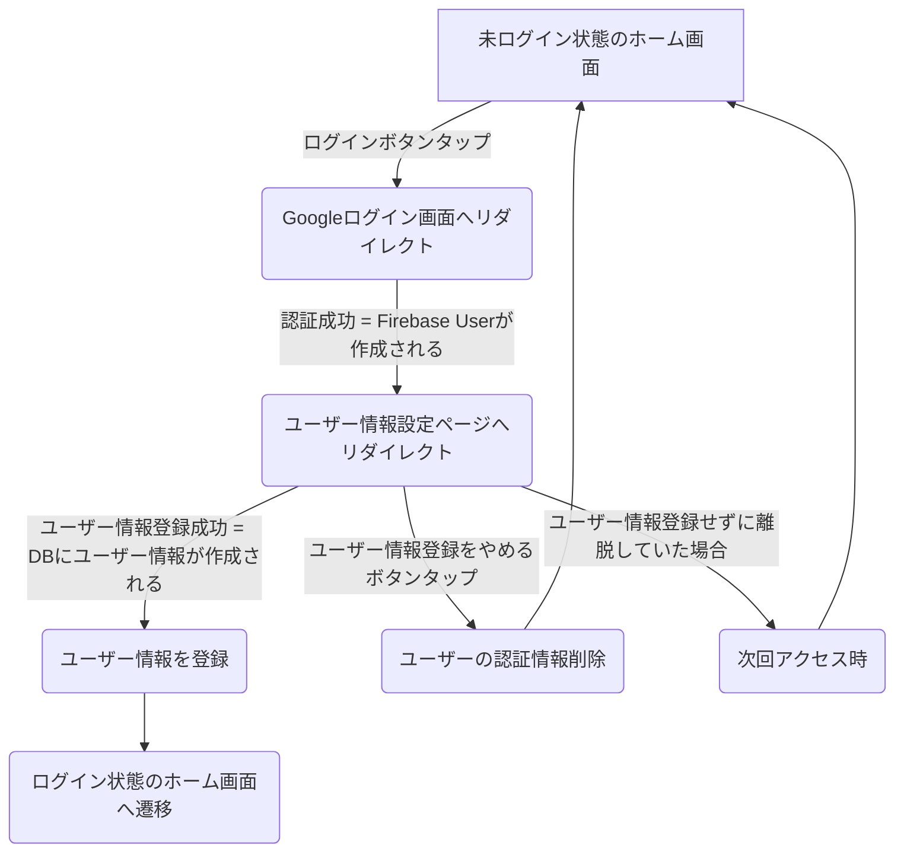
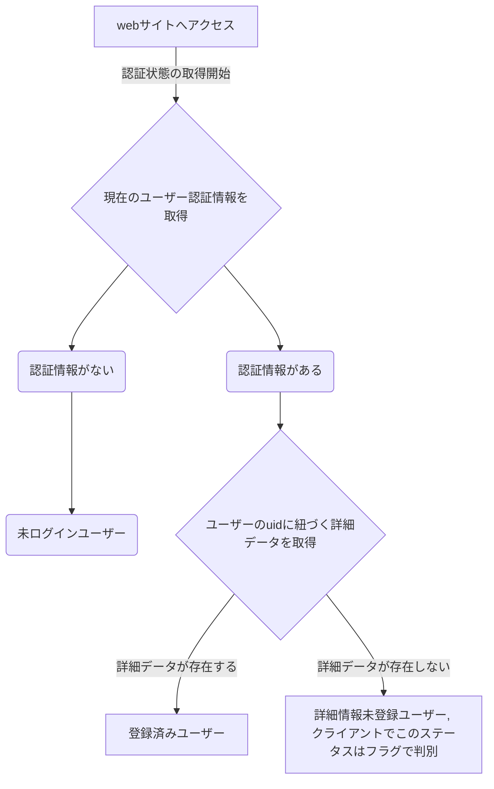

ログインフロー

```mermaid
graph TD
    A[未ログイン状態のホーム画面] --> |ログインボタンタップ| B(Googleログイン画面へリダイレクト)
    B --> |認証成功 = Firebase Userが作成される| C(ユーザー情報設定ページへリダイレクト)
    C --> |ユーザー情報登録成功 = DBにユーザー情報が作成される| D(ユーザー情報を登録)
    C --> |ユーザー情報登録をやめるボタンタップ| E(ユーザーの認証情報削除)
    C --> |ユーザー情報登録せずに離脱していた場合| F(次回アクセス時)
    D --> G(ログイン状態のホーム画面へ遷移)
    E --> A
    F --> A
```

サイトアクセス時の認証情報取得フロー

```mermaid
graph TD
    A[webサイトへアクセス] --> |認証状態の取得開始| B{現在のユーザー認証情報を取得}

    B --> C(認証情報がない)
    B --> D(認証情報がある)

    C --> E(未ログインユーザー)

    D --> F{ユーザーのuidに紐づく詳細データを取得}
    F --> |詳細データが存在する| G[登録済みユーザー]
    F --> |詳細データが存在しない| H[詳細情報未登録ユーザー, クライアントでこのステータスはフラグで判別]
```
